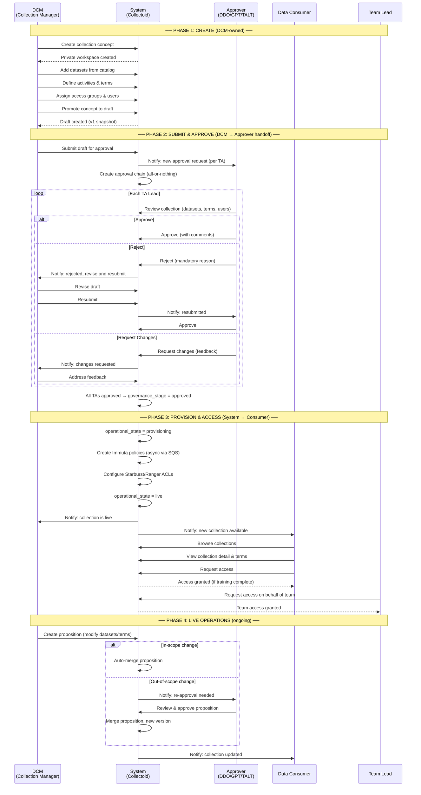
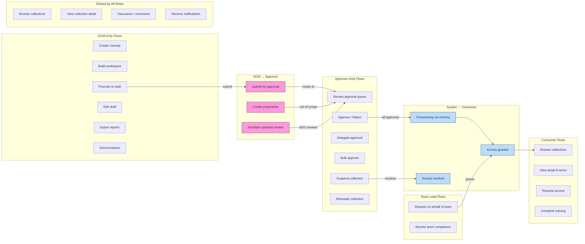
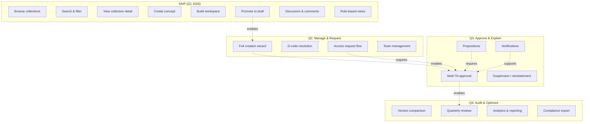

# User Journey Flows & Role Crossover

## Core Lifecycle — End-to-End Swimlane

This diagram shows the primary collection lifecycle and where roles hand off to each other.

## Role Crossover Map

Shows which journeys involve handoffs between roles.

## MVP vs Future — Flow Scope

## Prioritized Journey List (All Roles Combined)

Frequency: how often this journey is performed across all users.

| Priority | Journey | Primary Role | Crosses To | Frequency |
|----------|---------|-------------|------------|-----------|
| 1 | Browse & discover collections | All | — | Very High (daily) |
| 2 | View collection detail | All | — | Very High (daily) |
| 3 | Create a new collection | DCM | — | High (weekly) |
| 4 | Build workspace (datasets, terms, users) | DCM | — | High (weekly) |
| 5 | Receive notifications & act | All | — | High (daily) |
| 6 | Review approval queue | APP | — | High (daily) |
| 7 | Submit for approval | DCM | APP | Medium (weekly) |
| 8 | Approve / reject collection | APP | DCM, DC | Medium (weekly) |
| 9 | Request access to collection | DC | — | Medium (weekly) |
| 10 | Participate in discussion | All | — | Medium (daily) |
| 11 | Monitor collection health | DCM | — | Medium (weekly) |
| 12 | Propose changes to live collection | DCM | APP | Medium (monthly) |
| 13 | Request access on behalf of team | TL | DC | Medium (monthly) |
| 14 | Monitor team compliance | TL | — | Medium (monthly) |
| 15 | Review & approve proposition | APP | DCM | Low (monthly) |
| 16 | Complete onboarding & training | DC, TL | — | Low (once) |
| 17 | Quarterly review cycle | DCM, APP | — | Low (quarterly) |
| 18 | Delegate approval | APP | APP | Low (as needed) |
| 19 | Suspend collection | APP | DCM, DC | Rare (emergency) |
| 20 | Reinstate collection | APP, DCM | DC | Rare (post-emergency) |
| 21 | Decommission collection | DCM | DC | Rare (end-of-life) |
| 22 | Export compliance reports | DCM | — | Low (quarterly) |
